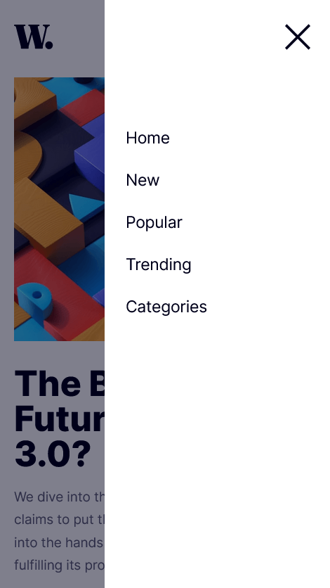

# Frontend Mentor - News homepage solution

This is a solution to the [News homepage challenge on Frontend Mentor](https://www.frontendmentor.io/challenges/news-homepage-H6SWTa1MFl). Frontend Mentor challenges help you improve your coding skills by building realistic projects.

## Table of contents

- [Overview](#overview)
  - [The challenge](#the-challenge)
  - [Screenshot](#screenshot)
  - [Links](#links)
- [My process](#my-process)
  - [Built with](#built-with)
  - [What I learned](#what-i-learned)
- [Author](#author)

## Overview

### The challenge

Users should be able to:

- View the optimal layout for the interface depending on their device's screen size
- See hover and focus states for all interactive elements on the page
- **Bonus**: Toggle the mobile menu (requires some JavaScript)

### Screenshot

Desktop

---

Mobile

---

Mobile menu

### Links

- Solution URL: [https://github.com/mihalymarcell86/news-homepage](https://github.com/mihalymarcell86/news-homepage)
- Live Site URL: [https://mihalymarcell86.github.io/news-homepage/](https://mihalymarcell86.github.io/news-homepage/)

## My process

### Built with

- Semantic HTML5 markup
- Sass
- Mobile-first workflow
- Vanilla JS

### What I learned

In this project, I used a subgrid for the first time.

## Author

- GitHub - [@mihalymarcell86](https://www.github.com/mihalymarcell86)
- Frontend Mentor - [@mihalymarcell86](https://www.frontendmentor.io/profile/mihalymarcell86)
